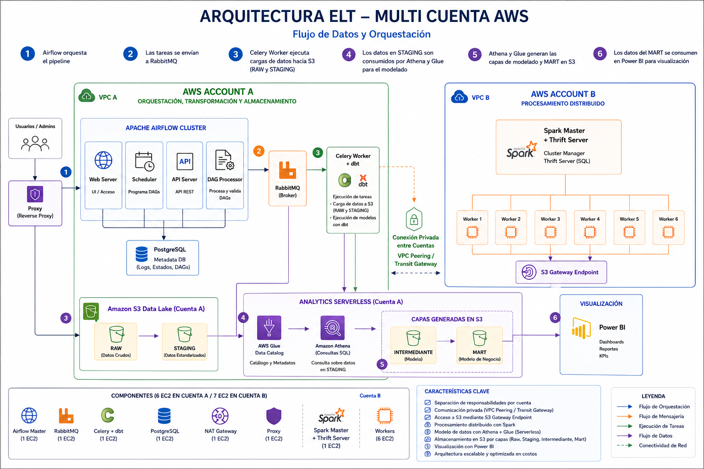

# Sirius — Pipeline ELT Distribuido

Pipeline ELT dockerizado para procesar datos históricos de viajes de taxi NYC (TLC Trip Record Data) utilizando Airflow, Spark, dbt, AWS Glue, Athena y Power BI. El proyecto escala horizontalmente mediante un cluster Spark de 6 workers y orquestación por periodos (año-mes) para evitar saturar el scheduler.

> **Nota:** Este README asume que ya cuentas con el archivo `.env.template` en cada servicio para variables sensibles. No se incluyen credenciales ni secrets en este documento.

---

## Arquitectura



### Infraestructura AWS (13 nodos)

| Rol | Servicio | Cantidad | Descripción |
|-----|----------|----------|-------------|
| Orquestación | Airflow Master | 1 | Scheduler, API Server, DAG Processor |
| Orquestación | Airflow Worker | 1 | Ejecuta tareas Celery |
| Mensajería | RabbitMQ | 1 | Broker para colas de Celery |
| Procesamiento | Spark Master | 1 | Nodo maestro del cluster Spark |
| Procesamiento | Spark Worker | 6 | Nodos de ejecución paralela |
| Proxy | Nginx Proxy Manager | 1 | Reverse proxy y gestión de certificados |

Airflow utiliza una instancia de PostgreSQL independiente para sus metadatos.

---

## Stack Tecnológico

- **Orquestación:** Apache Airflow 3.2.0
- **Procesamiento:** Apache Spark 3.5.1 (cluster mode)
- **Transformación:** dbt-core + dbt-spark (con PyHive)
- **Data Lake / Warehouse:** AWS S3 + AWS Glue + Amazon Athena
- **Visualización:** Power BI
- **Base de datos:** PostgreSQL (metadatos Airflow únicamente)
- **Broker:** RabbitMQ 3-management
- **Proxy:** Nginx Proxy Manager

---

## Flujo del Pipeline

El pipeline se ejecuta por **formato de datos** (FHV, Yellow, Green, HVFHV) y por **periodo (año-mes)**:

### Capa Raw y Staging (dbt + Spark)
1. **Orquestador** (`*_orquestador.py`): Genera automáticamente los periodos (año-mes) a partir de un rango definido. Por cada periodo, dispara una ejecución del pipeline de staging correspondiente vía API REST de Airflow.
2. **Staging Pipeline** (`*_staging_pipeline.py`): Verifica en S3 si el periodo ya fue procesado. Si no existe, ejecuta los modelos dbt de staging correspondientes sobre Spark, escribiendo resultados en Parquet dentro de `s3://sirius-logs-riwi/tlc/staging/<formato>/anio=<anio>/mes=<mes>/`.

### Capa Intermediate y Mart (AWS Glue + Athena)
3. **Intermediate y Mart**: Los datos parqueados en S3 se catalogan mediante AWS Glue (Data Catalog) y se consultan/transforman con Amazon Athena para construir las capas intermedia y de mart, aprovechando la integración nativa con S3 sin necesidad de mover datos.

### Visualización
4. **Power BI**: Se conecta directamente a Athena (o a las tablas Glue) para consumir las consultas del mart y generar los dashboards de negocio.

> **Nota:** Se intentó inicialmente cargar los datos procesados a PostgreSQL mediante `load_to_postgres.py`, pero la instancia de base de datos no cuenta con espacio suficiente para el volumen masivo de datos instáricos. Por ello, el destino final de los datos es S3 + Glue + Athena.

El orden de ejecución de formatos está definido en `maestro_staging_pipeline.py`:
`FHV → Yellow → Green → HVFHV`

### Tiempos de procesamiento

Por el volumen masivo de datos instáricos, el tiempo estimado es de **aproximadamente 2 horas por formato**, variando según la cantidad de workers Spark activos.

---

## Estructura del Repositorio

```
.
├── master/                        # Airflow Master
│   ├── docker-compose.yml
│   └── .env
├── worker/                        # Airflow Worker (Celery)
│   ├── docker-compose.yml
│   ├── Dockerfile
│   └── .env
├── master-spark/                  # Spark Master + Thrift Server
│   ├── docker-compose.yml
│   └── .env
├── worker-spark/                  # Spark Workers
│   ├── docker-compose.yml
│   └── .env
├── rebbitmq/                      # RabbitMQ
│   ├── docker-compose.yml
│   └── .env
├── nginx-proxy-manager/           # Reverse Proxy
│   ├── docker-compose.yml
│   └── .env
├── pipelines/
│   ├── dags/                      # DAGs de Airflow
│   │   ├── maestro_staging_pipeline.py
│   │   ├── fhv_orquestador.py
│   │   ├── fhv_staging_pipeline.py
│   │   ├── yellow_orquestador.py
│   │   ├── yellow_staging_pipeline.py
│   │   ├── green_orquestador.py
│   │   ├── green_staging_pipeline.py
│   │   ├── hvfhs_orquestador.py
│   │   ├── hvfhs_staging_pipeline.py
│   │   ├── load_to_postgres.py
│   │   └── spark_start_only.py
│   ├── data_transformation/       # Proyecto dbt
│   │   ├── dbt_project.yml
│   │   ├── models/
│   │   │   ├── staging/           # Modelos staging (por formato)
│   │   │   └── warehouse/         # Modelos warehouse (por formato)
│   │   ├── macros/
│   │   ├── seeds/
│   │   ├── tests/
│   │   └── analyses/
│   └── scripts/
│       └── s3_to_postgres_loader.py
├── airflow/
│   └── config/
├── flujo_pipeline.png             # Diagrama de arquitectura
├── pyproject.toml
└── README.md
```

---

## Variables de Entorno

Cada servicio contiene un `.env.template` con las variables requeridas. Las variables críticas son:

### Airflow Master / Worker
- `AIRFLOW_UID`: UID del usuario Airflow
- `AIRFLOW_API_URL`: URL del API de Airflow (usado por los orquestadores)
- `AIRFLOW_API_USER`: Usuario para autenticación en el API
- `AIRFLOW_API_PASS`: Contraseña para el API
- `S3_BUCKET`: Nombre del bucket S3 (ej: `sirius-logs-riwi`)
- `AWS_ACCESS_KEY_ID`: Access key para S3/Glue/Athena
- `AWS_SECRET_ACCESS_KEY`: Secret key para S3/Glue/Athena
- `AWS_DEFAULT_REGION`: Región AWS (ej: `us-east-2`)
- `AIRFLOW_CONN_MY_POSTGRES_DB`: Connection string de PostgreSQL (metadatos Airflow / referencia para script de carga no productivo)
- `GIT_REPO_URL`: Repositorio donde se sincronizan los DAGs
- `GIT_BRANCH`: Rama del repositorio
- `GIT_SYNC_PERIOD`: Frecuencia de sincronización (ej: `60s`)

### Spark Master / Workers
- `SPARK_DRIVER_MEMORY`: Memoria del driver (ej: `3g`)
- `SPARK_WAREHOUSE_DIR`: Directorio del warehouse de Hive
- `SPARK_LOCAL_IP`: IP de la instancia
- `SPARK_PUBLIC_DNS`: DNS público de la instancia

### RabbitMQ
- `RABBITMQ_DEFAULT_USER`
- `RABBITMQ_DEFAULT_PASS`

---

## Deployment

### Requisitos
- Docker Engine >= 20.10
- Docker Compose >= 2.0
- Acceso a AWS con credenciales configuradas

### Orden de Inicialización Recomendado

```bash
# 1. RabbitMQ (dependencia de Airflow)
cd rebbitmq
docker compose up -d

# 2. Spark Master + Workers
cd master-spark
docker compose up -d

cd worker-spark
docker compose up -d

# 3. Airflow Master
cd master
docker compose up -d

# 4. Airflow Worker
cd worker
docker compose up -d

# 5. Proxy (opcional, para exponer servicios)
cd nginx-proxy-manager
docker compose up -d
```

> **Nota:** Los stacks de Spark y Airflow pueden levantarse en paralelo siempre que RabbitMQ ya esté healthy. El `airflow-init` del master se encarga de migrar la base de datos automáticamente.

### Verificación

- Airflow UI: `http://<tu-dominio>:8080`
- Flower (monitoreo Celery): `http://<tu-dominio>:5555`
- Spark Master UI: `http://<coloca_tu_ip_master_spark>:8080`
- RabbitMQ Management: `http://<tu-dominio>:15672`

---

## Ejecución de Pipelines

### Pipeline Maestro
Trigger manual desde la UI de Airflow:
- DAG: `maestro_staging_pipeline`
- Ejecuta secuencialmente: FHV → Yellow → Green → HVFHV

### Orquestadores Individuales
Cada formato tiene su propio orquestador que define el rango año-mes:
- `fhv_orquestador` (2025-2026 por defecto)
- `yellow_orquestador` (2020-2026 por defecto)
- `green_orquestador`
- `hvfhs_orquestador`

Los orquestadores consultan el API de Airflow, disparan el pipeline de staging correspondiente por cada periodo y esperan su finalización antes de continuar con el siguiente.

### Staging Pipelines
Cada `*_staging_pipeline.py` procesa **un solo periodo (año-mes)**. Antes de ejecutar dbt, verifica en S3 si el periodo ya fue procesado para evitar reprocesamiento:

```text
s3://sirius-logs-riwi/tlc/staging/<formato>/anio=<anio>/mes=<mes>/
```

### Carga a PostgreSQL (No utilizada como destino final)
El DAG `load_postgres` y el script `s3_to_postgres_loader.py` se desarrollaron para cargar datos a PostgreSQL vía `COPY`. Sin embargo, **no se utiliza como destino final** debido a limitaciones de espacio en la base de datos para el volumen masivo de datos TLC. El flujo productivo actual entrega los datos en S3 y se consultan a través de Athena.

> Estos componentes se mantienen en el repositorio como referencia de trabajo explorado.

---

## dbt y Documentación

El proyecto dbt se encuentra en `/opt/airflow/dags/current/pipelines/data_transformation`.

### Capas implementadas
- **Raw:** Datos originales ingestados en S3.
- **Staging:** Modelos dbt ejecutados con Spark, materializados como tablas Parquet en S3.
- **Intermediate y Mart:** Construidos sobre AWS Glue (Data Catalog) y consultados con Amazon Athena. dbt documenta el modelo de staging; las capas superiores se gestionan con Glue/Athena.

### Materializaciones
- **Staging:** `table` en formato Parquet en S3

### Documentación
Ejecuta `dbt docs generate` y `dbt docs serve` para generar y visualizar la documentación del modelo de datos (lineage, descripciones de columnas, tests) de la capa de staging.

---

## Análisis Exploratorio (EDA)

> **Advertencia:** El volumen de datos de TLC es extremadamente grande. Realizar EDA cargando los archivos completos en pandas puede saturar la memoria de tu máquina local.

**Recomendación:** Utiliza **DuckDB** para consultas SQL directas sobre archivos Parquet sin necesidad de cargar todo el dataset en memoria:

```python
import duckdb

# Ejemplo: contar filas por año en un archivo Parquet
con = duckdb.connect()
result = con.execute("""
    SELECT year, COUNT(*) 
    FROM read_parquet('s3://<tu-bucket>/tlc/raw/yellow/*.parquet') 
    GROUP BY year
""").fetchdf()
```

---

## Troubleshooting

| Síntoma | Causa probable | Solución |
|---------|---------------|----------|
| Airflow no muestra los DAGs | git-sync no sincronizó | Revisar logs de `airflow-git-sync` y credenciales del repo |
| Celery no ejecuta tareas | RabbitMQ no accesible | Verificar connectivity y credenciales de RabbitMQ |
| Spark no conecta al master | `network_mode: host` mal configurado | Verificar IPs y puertos 7077/8080 abiertos |
| dbt falla con error S3/Glue | Credenciales AWS inválidas o región incorrecta | Verificar `AWS_ACCESS_KEY_ID`, `AWS_SECRET_ACCESS_KEY` y `AWS_DEFAULT_REGION` en `.env` |
| Athena nolee tablas Glue | Crawler no ejecutado o base de datos Glue incorrecta | Verificar que el Data Catalog de Glue apunte al bucket y prefijo correctos |
| Timeout en ejecución dbt | Memory shortage en workers Spark | Aumentar `spark.executor.memory` o agregar workers Spark |
| DAGs se atascan en `queued` | Celery worker no healthy | Revisar `celery inspect ping` dentro del contenedor worker |

---

## Scripts Útiles

- `pipelines/scripts/s3_to_postgres_loader.py`: Carga genérica de Parquet S3 → PostgreSQL vía `COPY` (desarrollada pero no utilizada en el flujo productivo).
